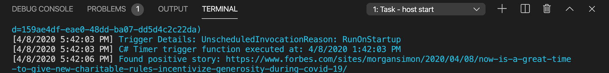

# About

I built a serverless application that sends me a positive news story related to COVID-19 every morning before I wake up, via text message.

During this ongoing pandemic, my problem has been too much news consumption, and a lot of it impacts me negatively. I figured now would be an excellent opportunity to create something that brings a little positivity into my day.

I have this terrible habit of checking my phone notifications while I'm brushing my teeth, so why not have something to read that makes me feel hopeful.


# 👩🏽‍💻 How to setup code environment

[Follow this tutorial and you will install VS Code and the necessary Azure extensions needed.](https://docs.microsoft.com/en-us/azure/azure-functions/functions-create-first-function-vs-code?pivots=programming-language-csharp)

# 🛠 Setup API keys and credentials

You will need:
- [TwilioSid, TwilioAuthToken, TwilioPhoneNumber](https://www.twilio.com/docs/usage/tutorials/how-to-use-your-free-trial-account)
- [Azure account, CognitiveServicesEndpoint and TextAnalyticsApiKeyCredential](https://docs.microsoft.com/en-us/azure/cognitive-services/text-analytics/quickstarts/text-analytics-sdk?tabs=version-3&pivots=programming-language-csharp)
- [NewsApiKey](https://newsapi.org/docs/get-started)

# 📦 Packages used

These should be included in the project when you clone it, however if there is some error, you can reinstall them.

### [Twilio](https://www.twilio.com/docs/sms/quickstart/csharp-dotnet-core])

[Install via .NET CLI](https://docs.microsoft.com/en-us/nuget/consume-packages/install-use-packages-dotnet-cli)
```shell
dotnet add package Twilio
```
Use
```csharp
using Twilio;
using Twilio.Rest.Api.V2010.Account;
```

### [TextAnalytics v3 preview](https://www.nuget.org/packages/Azure.AI.TextAnalytics/1.0.0-preview.3)

[Install via .NET CLI](https://docs.microsoft.com/en-us/nuget/consume-packages/install-use-packages-dotnet-cli)
```shell
dotnet add package Azure.AI.TextAnalytics --version 1.0.0-preview.3
```
Use
```csharp
using Azure.AI.TextAnalytics;
```
# 🔑 How to setup local.settings.json

I've excluded my local.settings.json file for obvious reasons. Make sure to include these records in there once you have them. You should have set [these up in the setup API keys and credentials step.](#Setup-API-keys-and-credentials)

[Microsoft timezone documentation](https://docs.microsoft.com/en-us/previous-versions/windows/it-pro/windows-vista/cc749073(v=ws.10)?WT.mc_id=personal-blog-marouill#time-zones)

```json
{
  "IsEncrypted": false,
  "Values": {
    "AzureWebJobsStorage": "<replace_with_your_webjobsstorage>",
    "FUNCTIONS_WORKER_RUNTIME": "dotnet",
    "TextAnalyticsApiKeyCredential":"<replace>",
    "CognitiveServicesEndpoint":"<replace>",
    "TwilioSid":"<replace>",
    "TwilioAuthToken":"<replace>",
    "NewsApiKey":"<replace>",
    "TwilioPhoneNumber":"<replace>",
    "MyPhoneNumber":"<replace_with_number_you_ant_to_send_sms_to>",
    "WEBSITE_TIME_ZONE":"<replace_with_your_timezone"
  }
}
```

# ⚡️ How to execute locally

In VS code, select the run Tab on the left, then hit the Play button on the top.


## What is RunOnStartUp?
The app will run once since the 
```csharp
RunOnStartup=true
```
is set to true. Before deploying to production, remove this, according to Microsoft:

[If true, the function is invoked when the runtime starts. For example, the runtime starts when the function app wakes up after going idle due to inactivity. when the function app restarts due to function changes, and when the function app scales out. So runOnStartup should rarely if ever be set to true, especially in production.](https://docs.microsoft.com/en-us/azure/azure-functions/functions-bindings-timer?tabs=csharp#configuration)

# 📳 Demo

You will get a text to the number you put into your local.settings.json


In the VS code console output you will also see the story it sent you.



You will also see it in your [Twilio SMS dashboard](https://www.twilio.com/console/sms)


# 🚀 How to deploy to Azure

[Here is a written tutorial on how to Publish a Function to Azure](https://docs.microsoft.com/en-us/azure/azure-functions/functions-create-first-function-vs-code?pivots=programming-language-csharp#publish-the-project-to-azure)

[My Youtube video also shows how to do this.](linktoytvideo.com)

Please make sure to remove RunOnStartUp in the trigger or set to false. See [here](#what-is-RunOnStartUp?) and this [Microsoft doc](https://docs.microsoft.com/en-us/azure/azure-functions/functions-bindings-timer?tabs=csharp#configuration)

# ⏰ Change what time the app runs

This line here has the cron expression

```csharp
public static void Run([TimerTrigger("0 30 6 * * *", RunOnStartup=true)]TimerInfo myTimer, ILogger log)
```

If you would like to change the time, change the expression part, [here are some examples.](https://docs.microsoft.com/en-us/azure/azure-functions/functions-bindings-timer?tabs=csharp#ncrontab-expressions)
```csharp
"0 30 6 * * *"
```

# 🗞 Fine tune your news feed

You can fine tune the JSON returned from News API with [these parameters](https://newsapi.org/docs/endpoints/everything) simply add/remove/edit the variables of the newsAPIEndpointURL
```csharp
// NEWS API Search parameters and URL
string searchKeyword = "Covid";
string sortBy = "publishedAt";
string pageSize = "50";
string searchLanguage = "en";
var newAPIEndpointURL = $"https://newsapi.org/v2/everything?sortBy={sortBy}&pageSize={pageSize}&language={searchLanguage}&q={searchKeyword}&apiKey={newsApiKey}";
```
# 👷🏽‍♀️ Known issues and areas of improvement

- Some of the stories sent are not necessarily positive, but since they contain words like "tests positive" they are returned as positive sentiment.

- I haven't been programming for very long so I know I might not be following best practices (OOP design and error handling), I will try to improve that as I get more practice and experience. 

# 💙 Thanks to 

- The amazing community at [Dev.to](https://dev.to) and [Twilio](https://twilio.com). Here is the [link to the hackathon post](https://dev.to/devteam/announcing-the-twilio-hackathon-on-dev-2lh8) if you'd also like to participate (Do it 😊).
- Powered by [newsapi.org](NewsApi.org)
- Twilio for providing credits to work on thie project